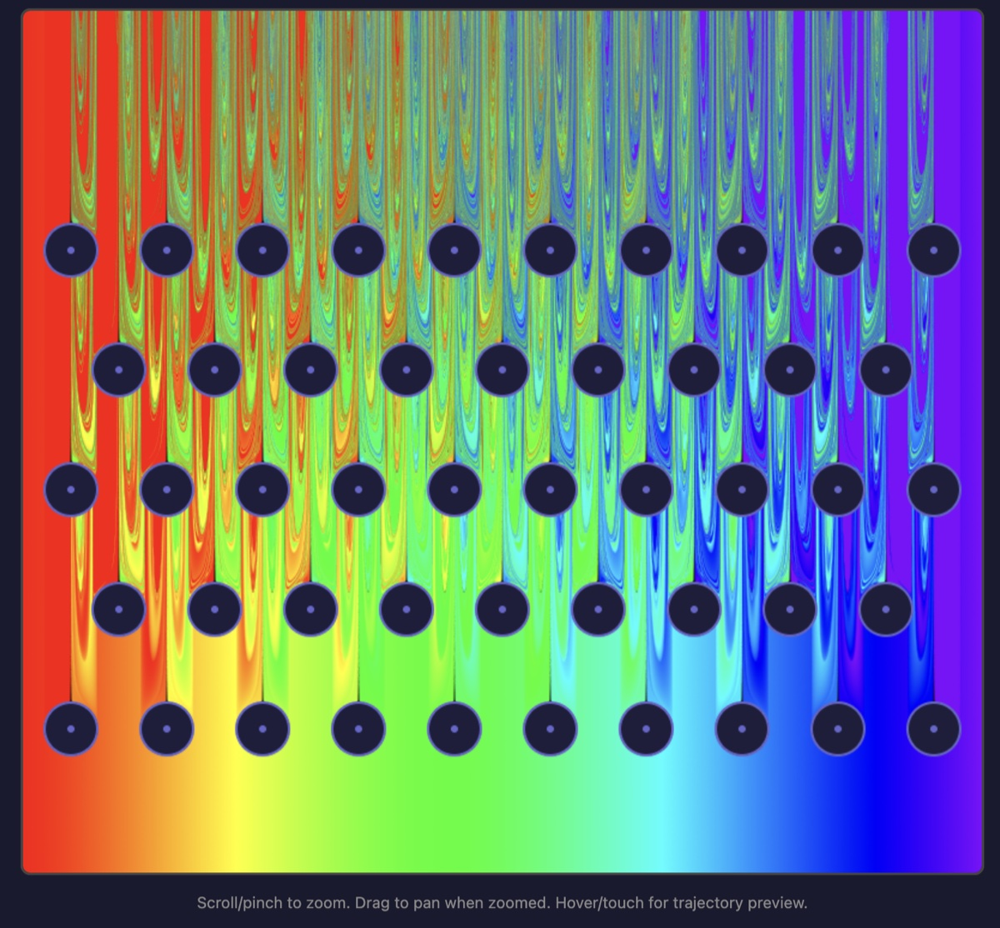

# Plinko Fractal

**Live demo: https://jeremyiv.github.io/plinko-fractal-2/**

Where does a plinko ball land? This is an interactive map of the answer: every pixel is a
drop point, colored by the final landing position of a ball released there (red on the far
left through violet on the far right). Near the pegs, arbitrarily small changes in the drop
point change which side of a peg the ball clips — so the basin boundaries are fractal, and
you can zoom in (up to 100,000×) forever-ish.

## Controls

- **Scroll / pinch** to zoom (centered on the cursor)
- **Drag** to pan when zoomed in
- **Hover / touch** to preview the exact ball trajectory from that point

## How it works

Everything lives in a single `index.html` with no dependencies.

- The fractal is computed in a WebGL fragment shader: each pixel simulates a full ball drop
  under parabolic free flight. Peg collisions are found **exactly** by solving the quartic
  `|p(t) − peg|² = r²` (cubic roots of the derivative bracket the intervals, then bisection),
  so there's no timestep error to accumulate — important when you're zoomed in 10⁵×.
- Candidate pegs are pruned with an axial **hex-grid lookup** (see
  [hex-grid-lookup.md](hex-grid-lookup.md)) instead of testing all 48 pegs per bounce.
- The image is refined progressively: each frame renders one jittered sample and blends it
  into an accumulation buffer (ping-pong framebuffers), up to 300 samples of anti-aliasing.
  During zoom/pan it drops to a quarter-resolution fast preview, then re-converges when you
  let go.
- The trajectory preview is the same physics re-implemented in JavaScript, drawn on a 2D
  canvas overlay (with a mini-board popup when zoomed in).
